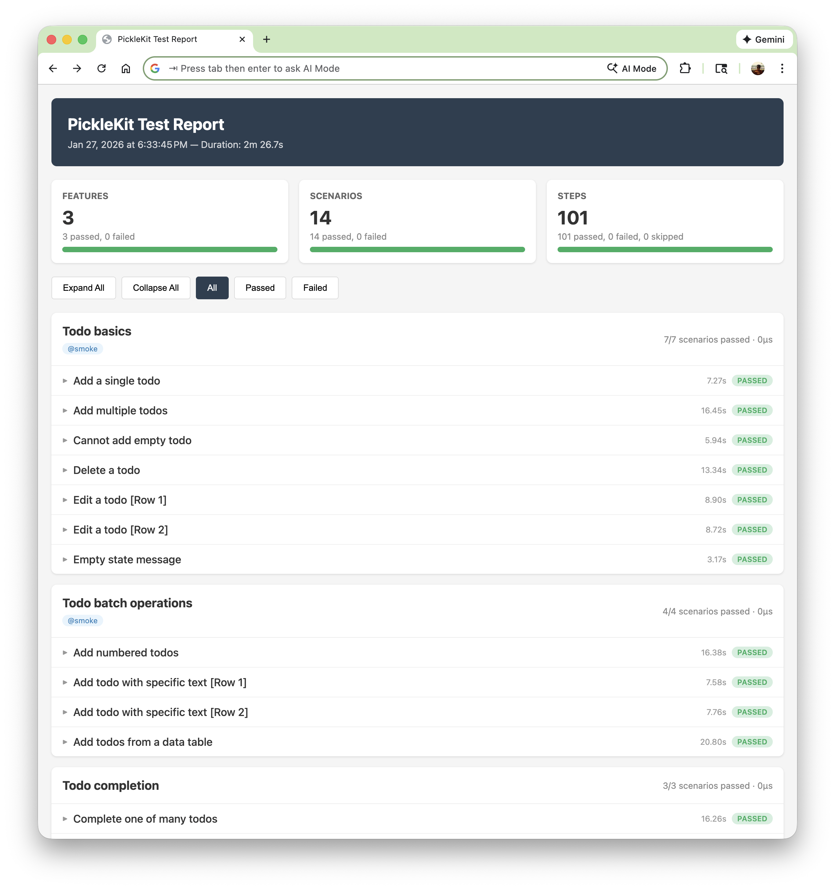
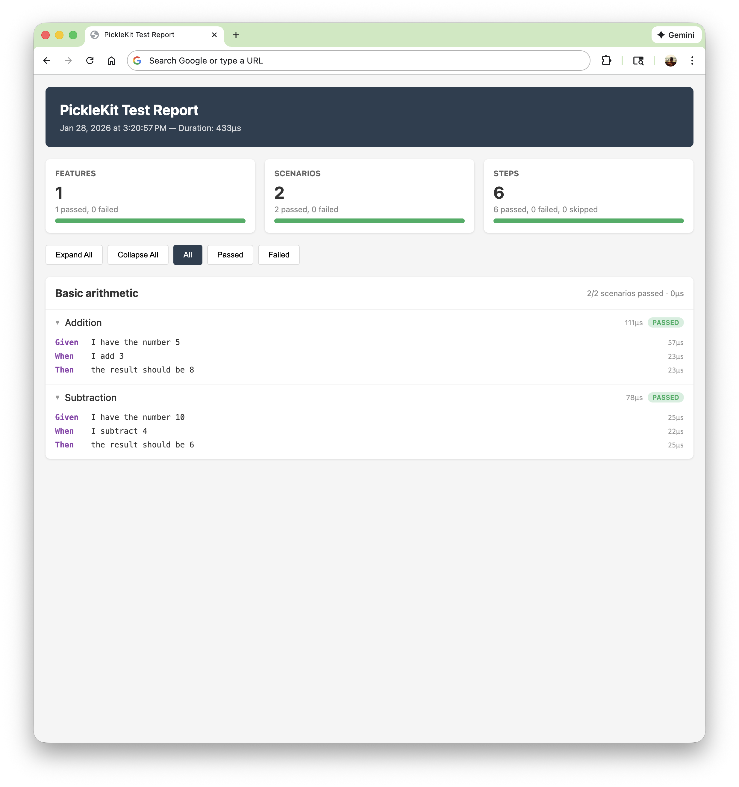

# PickleKit

[](https://github.com/nycjv321/pickle-kit/actions/workflows/ci.yml)
[](https://github.com/nycjv321/pickle-kit)
[](https://swift.org)
[](https://opensource.org/licenses/MIT)
[](https://claude.ai)

A standalone Swift Cucumber/BDD testing framework with zero external dependencies. Parse Gherkin `.feature` files, register step definitions with regex patterns, and run scenarios — integrated with both Swift Testing and XCTest.

## Installation

Add PickleKit to your `Package.swift`:

```swift
dependencies: [
    .package(url: "https://github.com/nycjv321/pickle-kit.git", from: "0.1.0"),
],
targets: [
    .testTarget(
        name: "MyTests",
        dependencies: ["PickleKit"],
        resources: [.copy("Features")]
    ),
]
```

## Quick Start

### 1. Write a feature file

```gherkin
# Tests/MyTests/Features/calculator.feature
Feature: Calculator

  Scenario: Addition
    Given I have the number 5
    When I add 3
    Then the result should be 8
```

### 2. Define step definitions

Create types conforming to the `StepDefinitions` protocol. Each stored `StepDefinition` property is automatically discovered via reflection:

```swift
import PickleKit

struct CalculatorSteps: StepDefinitions {
    nonisolated(unsafe) static var result = 0
    init() { Self.result = 0 }

    let givenNumber = StepDefinition.given("I have the number (\\d+)") { match in
        Self.result = Int(match.captures[0])!
    }

    let addNumber = StepDefinition.when("I add (\\d+)") { match in
        Self.result += Int(match.captures[0])!
    }

    let checkResult = StepDefinition.then("the result should be (\\d+)") { match in
        let expected = Int(match.captures[0])!
        assert(Self.result == expected, "Expected \(expected) but got \(Self.result)")
    }
}
```

### 3. Write a test

**Swift Testing (recommended)** — use `GherkinTestScenario` for library tests, unit tests, and CI pipelines:

```swift
import Testing
import PickleKit

@Suite(.serialized) struct CalculatorTests {
    static let scenarios = GherkinTestScenario.scenarios(
        bundle: .module, subdirectory: "Features"
    )

    @Test(arguments: CalculatorTests.scenarios)
    func scenario(_ test: GherkinTestScenario) async throws {
        let result = try await test.run(stepDefinitions: [CalculatorSteps.self])
        #expect(result.passed)
    }
}
```

<details>
<summary>XCTest alternative (GherkinTestCase)</summary>

Use `GherkinTestCase` when you need XCUITest for UI tests, or are working in a target where Swift Testing is unavailable (e.g., Xcode UI testing bundles):

```swift
import XCTest
import PickleKit

final class CalculatorTests: GherkinTestCase {
    override class var featureSubdirectory: String? { "Features" }
    override class var stepDefinitionTypes: [any StepDefinitions.Type] {
        [CalculatorSteps.self]
    }
}
```

</details>

<details>
<summary>Inline alternative (registerStepDefinitions)</summary>

With `GherkinTestCase`, you can also register steps inline — both approaches work and can coexist:

```swift
final class CalculatorTests: GherkinTestCase {
    override class var featureSubdirectory: String? { "Features" }

    override func registerStepDefinitions() {
        var result = 0

        given("I have the number (\\d+)") { match in
            result = Int(match.captures[0])!
        }

        when("I add (\\d+)") { match in
            result += Int(match.captures[0])!
        }

        then("the result should be (\\d+)") { match in
            let expected = Int(match.captures[0])!
            XCTAssertEqual(result, expected)
        }
    }
}
```

</details>

### 4. Run tests

```bash
swift test
```

Each scenario appears as a separate test in Xcode's test navigator.

## Why PickleKit

Before PickleKit, using Cucumber-style BDD in Swift required external toolchains — Ruby (via Cucumber), Java (via Karate), or CocoaPods-based frameworks. PickleKit provides a zero-dependency Swift-native Cucumber framework that integrates directly with Swift Testing and XCTest. No Gemfile, no Podfile, no build plugins — just a Swift package dependency.

## Gherkin Support

PickleKit supports the core Gherkin syntax:

- **Keywords** — `Feature`, `Background`, `Scenario`, `Scenario Outline`, `Given`, `When`, `Then`, `And`, `But`
- **Tags** — `@smoke`, `@wip`, etc. at feature and scenario level
- **Data Tables** — pipe-delimited tables accessible via `match.dataTable`
- **Doc Strings** — triple-quoted blocks accessible via `match.docString`
- **Scenario Outlines** — parameterized scenarios expanded from `Examples` tables
- **Backgrounds** — shared setup steps that run before every scenario
- **Comments** — lines starting with `#`

See [Gherkin Reference](docs/GHERKIN.md) for full syntax, step registration, tag filtering, and programmatic usage.

## HTML Test Reports

Generate Cucumber-style HTML reports with per-step results, timing, and status filtering:

```bash
PICKLE_REPORT=1 swift test
```

The report includes summary counts, per-feature sections with collapsible scenarios, per-step timing and error details, and interactive filtering controls.





See [Report Configuration](docs/REPORTING.md) for customization, xcodebuild integration, and programmatic generation.

## Architecture

```
Sources/PickleKit/
├── AST/                    # Feature, Scenario, Step, DataTable model types
├── Parser/                 # GherkinParser (state machine), OutlineExpander
├── Report/                 # HTML report generation (StepResult, HTMLReportGenerator, ReportResultCollector)
├── Runner/                 # StepRegistry, StepDefinitions, ScenarioRunner, TagFilter
├── SwiftTestingBridge/     # GherkinTestScenario (Swift Testing integration)
└── XCTestBridge/           # GherkinTestCase (XCTest integration)
```

All types are `Sendable`. Step handlers are `@MainActor async throws`.

## Requirements

- Swift 6.2+
- macOS 14+ / iOS 17+ / tvOS 17+ / watchOS 10+
- Swift Testing bridge (`GherkinTestScenario`) works on all platforms with Swift Testing support
- XCTest bridge (`GherkinTestCase`) requires ObjC runtime (Apple platforms)

## Testing

PickleKit follows the testing trophy model: invest most in integration tests, use unit tests for pure logic, and use Gherkin-driven E2E tests for critical user flows.

```bash
swift test                           # Run all PickleKit tests
swift test --filter ParserTests      # Run a specific test suite
PICKLE_REPORT=1 swift test           # Run tests + generate HTML report
```

See [Testing Guide](docs/TESTING.md) for test design philosophy, BDD rationale, and UI test best practices.

## Continuous Integration

PickleKit has a fully functioning CI pipeline via GitHub Actions that runs on every push and pull request. The pipeline has three jobs:

```
unit-tests ──┬──> ui-tests
             └──> build
```

Unit tests gate both the UI test and release build jobs, which run in parallel. See [Testing Guide](docs/TESTING.md) for CI configuration details and [Release Process](docs/RELEASE.md) for the automated release pipeline.

## AI-Assisted Development

PickleKit's Gherkin scenarios work as automated feedback loops improving the quality of the SDLC. This works especially well with AI coding agents. Write the spec in natural language, let the agent implement, run tests, and feed failures back — the same red-green-refactor cycle, with the agent doing the implementation. PickleKit itself was built this way with [Claude Code](https://claude.ai/claude-code).

See [AI-Assisted Development](docs/AI-DEVELOPMENT.md) for the workflow, lessons learned, and practical advice.

## Example: TodoApp with XCUITest

The [`Example/TodoApp`](Example/TodoApp) directory contains a complete macOS SwiftUI todo app that demonstrates PickleKit with XCUITest.


It includes:

- **3 targets**: TodoApp (application), TodoAppTests (unit tests for `TodoStore`), TodoAppUITests (Gherkin UI tests)
- **3 feature files** covering CRUD, completion toggling, data tables, scenario outlines, and tag filtering
- **Unit tests** for the `@Observable TodoStore` — verifying add, remove, update, clear, and toggle without UI
- **Step definitions** that drive `XCUIApplication` via accessibility identifiers
- **URL-scheme seeding** (`todoapp://seed`) for fast, deterministic test setup
- **xcodegen** project spec (`project.yml`) — run `xcodegen generate` to create the Xcode project

See [`Example/TodoApp/README.md`](Example/TodoApp/README.md) for setup and usage.

## License

MIT
